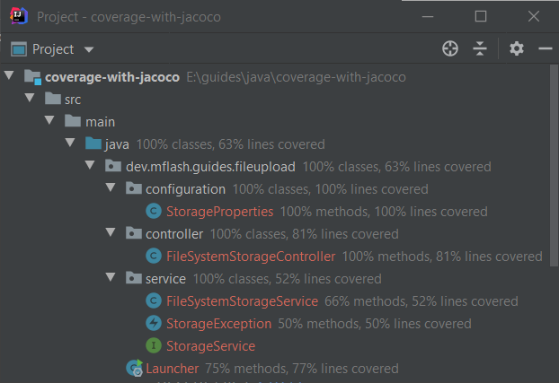

## Intent

Code coverage is a measure of how much of your code executes when the automated tests run. JaCoCo (Java Code Coverage), amongst many others, is a tool that enables developers to quantify this metric for an application written in Java.

> **Note** that the code coverage is as good as your tests. It merely tells you how much you are testing, not how well you are testing. You'll have to use other metrics, besides code coverage, to determine the quality of your code.

In this guide, you'll integrate JaCoCo with a Spring Boot application and get the coverage of the tests written for the application. 

### Setup

> This guide uses
> - Java 11
> - Spring Boot 2.1.8
> - JaCoCo 0.8.4

You should already have a Spring Boot application to start with. Download the project at the end of the post [Uploading files with Spring](/blog/2018/12/09/uploading-files-with-spring/) to follow this guide.

### Table of Contents

## Setup JaCoCo

Add the JaCoCo plugin in `pom.xml`.

```xml
<build>
  <plugins>
    <plugin>
      <groupId>org.jacoco</groupId>
      <artifactId>jacoco-maven-plugin</artifactId>
      <version>0.8.4</version>
      <executions>
        <execution>
          <id>start-agent</id>
          <goals>
            <goal>prepare-agent</goal>
          </goals>
        </execution>
        <execution>
          <id>generate-report</id>
          <goals>
            <goal>report</goal>
          </goals>
          <configuration>
            <title>Coverage with JaCoCo</title>
          </configuration>
        </execution>
      </executions>
    </plugin>
    <!-- Other plugins -->
  </plugins>
</build>
```

JaCoCo runs coverage by instrumenting the Java code through an agent. The first execution `start-agent`  ensures that this agent (called `JaCoCo Agent`) starts up before the coverage and the second execution `generate-report` generates a report. 

Execute `mvn package` or `mvn test` command to see this in action. After the build, you'll notice a `jacoco.exec` file in the `target` directory. You can open this file in your editor to see the results of coverage. 


Your editor may even show the coverage in the project window itself.



> **Note** that these screenshots are from IntelliJ Idea; other editors/IDEs may display coverage information differently. 

## Configure JaCoCo

JaCoCo provides a good amount of flexibility when it comes to configuration.

When the `mvn jacoco:report` task fires up, it generates reports in HTML, CSV and XML formats in a directory `target/site/jacoco`. You can use those files to integrate with a static analysis tool (like SonarQube) or publish the HTML report for other people to view. 


> **Note** that the appearance of the report may vary depending on your browser preferences.

You've already seen how you can configure the title of the report using the `title` key. For a comprehensive list of options, check out [jacoco:report documentation](https://www.eclemma.org/jacoco/trunk/doc/report-mojo.html).

### Coverage counters

You can also configure custom rules for coverage compliance. For example, the build will fail if the following rules are not compliant by the coverage.

```xml
<build>
  <plugins>
    <plugin>
      <groupId>org.jacoco</groupId>
      <artifactId>jacoco-maven-plugin</artifactId>
      <version>0.8.4</version>
      <executions>
        <!-- Other executions -->
        <execution>
          <id>check</id>
          <goals>
            <goal>check</goal>
          </goals>
          <configuration>
            <rules>
              <rule>
                <element>BUNDLE</element>
                <limits>
                  <limit>
                    <counter>INSTRUCTION</counter>
                    <value>COVEREDRATIO</value>
                    <minimum>0.80</minimum>
                  </limit>
                  <limit>
                    <counter>CLASS</counter>
                    <value>MISSEDCOUNT</value>
                    <minimum>10</minimum>
                  </limit>
                </limits>
              </rule>
            </rules>
          </configuration>
        </execution>
      </executions>
    </plugin>
    <!-- Other plugins -->
  </plugins>
</build>
```

Note that these rules are built around limits which are specified over a counter. Counters are used by JaCoCo to calculate different coverage metrics. 

For example, in the above example, a `BUNDLE` specifies that the coverage rules apply to the entire application with an instruction coverage of 80%. The instruction coverage provides information about the amount of code that has been executed or missed, irrespective of how your source code has been formatted. Similarly, a class coverage tells that at least one method of a class has been executed.

For a detailed account of coverage counters, check out the [official documentation](https://www.eclemma.org/jacoco/trunk/doc/counters.html).

## References

> **Source Code** &mdash; [coverage-with-jacoco](https://github.com/Microflash/guides/tree/master/java/coverage/coverage-with-jacoco)
>
> **Discussions**
> - [Maven plugin](https://www.eclemma.org/jacoco/trunk/doc/maven.html)
> - [Maven usage example](https://www.eclemma.org/jacoco/trunk/doc/examples/build/pom.xml)